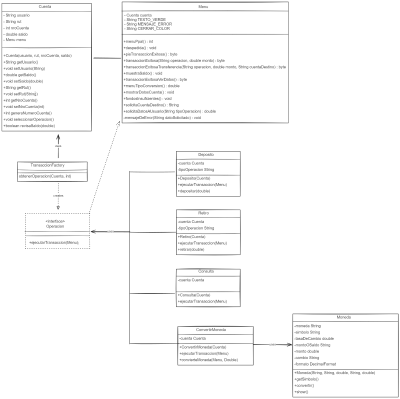

# AlkeWallet

AlkeWallet es una aplicación de gestión de billetera digital desarrollada en Java.

## Descripción

AlkeWallet es una aplicación que permite a los usuarios realizar diversas operaciones financieras como depósitos, retiros y consultas de saldo en una billetera digital. El proyecto utiliza el paradigma de la programación orientada a objetos para modelar los diferentes componentes del sistema y proporcionar una interfaz de usuario amigable para interactuar con la billetera digital.

## Funcionalidades

La aplicación AlkeWallet ofrece las siguientes funcionalidades:

- Depósito de fondos en la billetera digital.
- Retiro de fondos de la billetera digital.
- Consulta de saldo disponible en la billetera digital.
- Registro de transacciones y operaciones realizadas.

## Tecnologías utilizadas

El proyecto utiliza las siguientes tecnologías:

- Java: Lenguaje de programación principal.
- JUnit y Mockito: Para escribir y ejecutar pruebas unitarias.
- Git: Para control de versiones.
- Excalidraw.com: Para realizar diagrama

## Estructura del proyecto

El proyecto está estructurado de la siguiente manera:

AlkeWallet/  
│  
├─ src/  
│ ├─ clases/ # Clases del proyecto  
│ ├─ test/ # Pruebas unitarias  
│  
├─ README.md # Este archivo  
├─ .gitignore # Archivos ignorados por Git  

## Pruebas Unitarias

El proyecto incluye pruebas unitarias para verificar el correcto funcionamiento de las clases y métodos principales de la aplicación. Las pruebas unitarias se encuentran en el directorio `test/`.

## Instalación y Uso

1. Clona el repositorio:

git clone https://github.com/tu_usuario/AlkeWallet.git

2. Abre el proyecto en tu entorno de desarrollo preferido.

3. Compila y ejecuta el proyecto.

4. Explora las diferentes funcionalidades de la aplicación y realiza pruebas.

## Contribuciones

Las contribuciones son bienvenidas. Si encuentras algún error o deseas mejorar la aplicación, no dudes en abrir un issue o enviar un pull request.

## Diagrama UML

